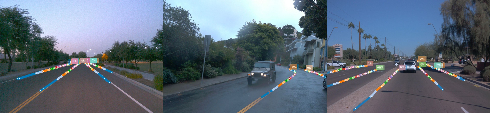
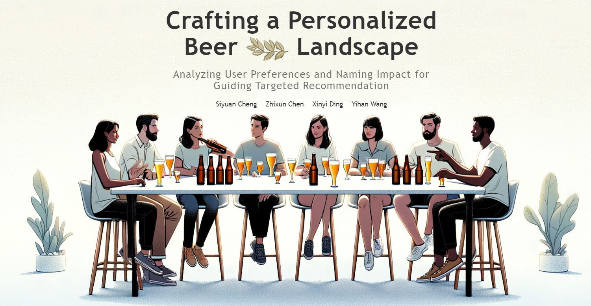
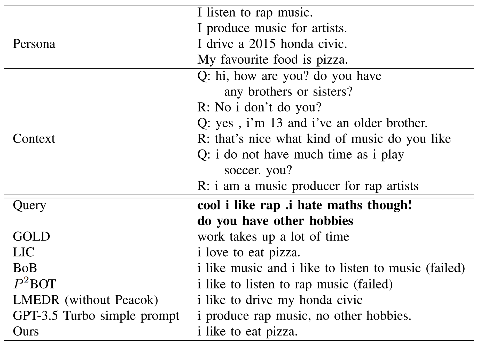
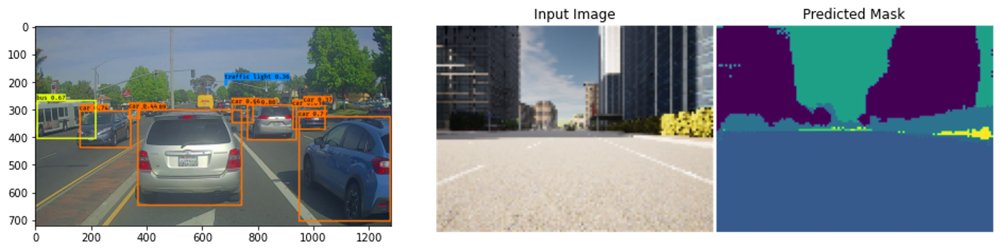
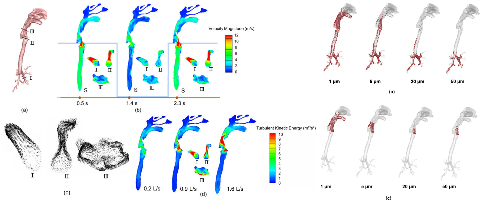

## Selected Projects

<!-- <h4 style="margin:0 0px 0;">2D Lane Detection with Human Pose Estimation </h4>

<ul style="margin:0; padding:0;">
<text>       
    As a final project for the course <a href="https://edu.epfl.ch/coursebook/fr/deep-learning-for-autonomous-vehicles-CIVIL-459" target="_blank">Deep Learning for Autonomous Vehicles</a> @ EPFL, we adjusted a deep neural network used for human pose estimation, <a href="https://github.com/openpifpaf/openpifpaf" target="_blank"> OpenPifPaf</a>, to achieve keypoint-based lane marker detection, which benefits the real-time application for the sparse representation. Specifically, we created new dataloader and plugin necessities to enable this network to be trained on <a href="https://github.com/The-OpenROAD-Project/OpenLane" target="_blank">OpenLane</a> dataset
      
    
</text>
   
</ul>
   -->

<h3 style="margin:0 0px 0;">Pose Estimation Based Monocular 3D Lane Detection </h3>

<ul style="margin:0; padding:0;">
<text>       
    We adjusted a deep neural network originally used for human pose estimation, <a href="https://github.com/openpifpaf/openpifpaf" target="_blank"> OpenPifPaf</a>, to to identify lane markers using a keypoint-based detection approach. This adaptation is particularly suited for real-time applications due to its sparse representation efficiency. To repurpose the network for lane detection, we developed new dataloaders and plugins, enabling it to be retrained on the <a href="https://github.com/The-OpenROAD-Project/OpenLane" target="_blank">OpenLane</a> dataset. A keypoint downsampling strategy was also investigated to facilitate the lane pose learning.Our modified 2D model matched the performance of leading 2D lane detection methods on the OpenLane benchmark on <a href="https://github.com/The-OpenROAD-Project/OpenLane" target="_blank">OpenLane</a> benchmark, as indicated by <a href="https://arxiv.org/abs/2203.11089" target="_blank">PersFormer</a>. Building on this, we extended this task into 3D domain. A monocular dense depth estimation method was incorporated, for which we finetuned with limited sparse depth annotations. This method facilitated the prediction of lane markers at distances exceeding the initial 80 meters limitation. Such improvements boost the model’s utility in outdoor autonomous driving scenarios.
      
    

        <video width="400" height="240" controls>
            <source src="../assets/img/lane_no_watermark.mp4" type="video/mp4" >
            Your browser does not support the video tag.
        </video>
    

</text>
   
</ul>
  

<h3 style="margin:0 0px 0;">Improving Neural Networks Performance with Zeroth-order and First-order Hybrid Optimization Methods </h3>
<ul style="margin:0; padding:0;">
<text>
   This project delves into the limitations of first-order (FO) gradient-based optimization in neural networks, exploring  their gradient-free zeroth-order (ZO) alternatives like ZO-SGD and ZO-signSGD. Using a PyTorch-based framework, we implemented and compared ZO and FO methods across various network configurations and hyperparameters, assessing time efficiency, convergence rate, stability and overall performance for hand-written digits classification task. The study reveals ZO methods' increased stability and lower hyperparameter sensitivity, attributed to the regularizing effect of perturbation techniques in gradient estimation. However, ZO methods were found to be more reliant on model architecture and scaling. A hybrid FO-ZO approach emerged as a balanced solution, optimizing both gradient computation costs and efficiency.
</text>
   
</ul>
  

<h3 style="margin:0 0px 0;">Crafting a Personalized Beer Landscape: Analyzing User Preferences and Naming Impact for Guiding Targeted Recommendation </h3>
<ul style="margin:0; padding:0;">
<text>
    This project takes a deep dive into beer popularity and user taste preferences using review datasets from <a href="https://www.beeradvocate.com/" target="_blank">BeerAdvocate</a> and <a href="https://www.ratebeer.com/" target="_blank">RateBeer</a>, consisting of both categorical ratings and textual reviews. Merging statistical methods with natural language processing techniques like sentiment analysis and word2vec, we uncovered a multi-faceted view of the beer domain, including the popularity of beer and the influence of naming on ratings, and the similarities between styles. Our findings provide tailored recommendations for users, considering not just popularity but also qualitative attributes and regional taste variations. An interactive webpage was also deployed, I invite you to click on the image and take a look at our data story. 
      
    

        
    

</text>
   
</ul>

  
<h3 style="margin:0 0px 0;">Training a Chatbot for Commonsense Persona-grounded Dialogue Generation </h3>
<ul style="margin:0; padding:0;">
<text>
    We participated in the <a href="https://www.aicrowd.com/challenges/commonsense-persona-grounded-dialogue-challenge-2023/problems/task-1-commonsense-dialogue-response-generation" target="_blank">Commonsense Persona-grounded Dialogue Challenge</a> organized by Sony and EPFL, which aims to generate dialogue responses that possess both persona consistency and contextual coherence. We enhanced a BART-based model by incorporating a knowledge-graph-based data augmentation technique and evaluated model performance given different set of augmentation settings and persona constraints. Our best-performing model achieved a word F1 score of 17.27, surpassing the baseline score of 17.001 set by GPT-3.5 Turbo using a simple prompt.
      
    

        
    

</text>
   
</ul>
  

<h3 style="margin:0 0px 0;">Deep Learning Specialization Projects </h3>
<ul style="margin:0; padding:0;">
<text>
    After initiating practical projects through the <a href="https://edu.epfl.ch/coursebook/fr/deep-learning-for-autonomous-vehicles-CIVIL-459" target="_blank">Deep Learning for Autonomous Vehicles</a> @ EPFL, I opted for a structured learning path to thoroughly understand deep learning as it applies to computer vision by enrolling in the <a href="https://www.coursera.org/specializations/deep-learning?utm_medium=sem&utm_source=gg&utm_campaign=B2C_EMEA_deep-learning_deeplearning-ai_FTCOF_specializations_country-multi&campaignid=20858198821&adgroupid=156245837229&device=c&keyword=deep%20learning%20certification&matchtype=b&network=g&devicemodel=&adposition=&creativeid=684249171979&hide_mobile_promo&gclid=Cj0KCQiA1rSsBhDHARIsANB4EJaT7BJYAGY5QAvCqjYBwP2bEqx7x7OFU89sH_UGh3XmmCNCpZxaYrMaAsaQEALw_wcB" target="_blank">Deep Learning Specialization</a> on Coursera. This program enabled me to acquire a robust theoretical foundation and hands-on experience in constructing efficient neural network architectures from the ground up—including ResNet, LSTM, Transformers, etc. Additionally, I applied these architectures to a range of computer vision tasks, such as vehicle detection using the YOLO framework and image segmentation utilizing the U-Net architecture.         
      
    

        
    

</text>
   
</ul>
  

## Publications

<h3 style="margin:0 0px 0;">Tracing the origin of large respiratory droplets by their deposition characteristics inside the respiratory tract during speech </h3>
<ul style="margin:0; padding:0;">
<text>
   <strong>Yihan Wang</strong>, Jianjian Wei,  Caroline X. Gao, Li Liu, <a href="https://pubmed.ncbi.nlm.nih.gov/37101943/" target="_blank">Building Simulation, 16, 781 – 794 (2023)</a>, orally presented in IEHB (2021).
      
    During the Covid-19 pandemic, the prevalence of asymptomatic and pre-symptomatic transmissions posed a continuous threat to public health, with the significance of airborne versus droplet-spray transmission being a subject of debate. To offer insights into non-pharmaceutical infection control measures, we carried out a computational fluid dynamics study to investigate the threshold at which differently-sized droplets, produced at primary SARS-CoV-2 replication sites, can escape during speech activities using a realistic human airway model. In conjunction with published medical data, our study emphasized the substantial risk posed by small droplets and highlighted the previously underestimated importance of the airborne transmission pathway.
    

        
    

</text>
   
</ul>