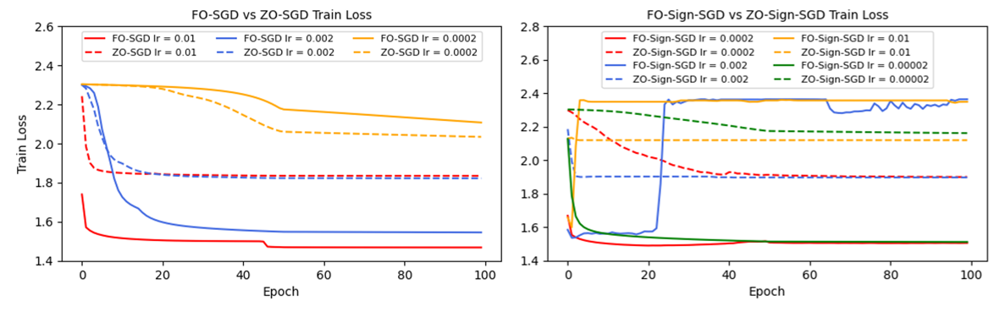
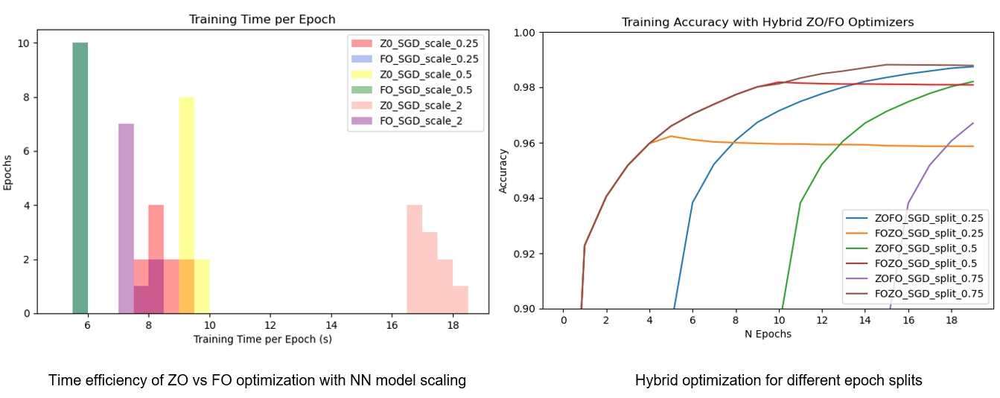

## Selected Projects

<h4 style="margin:0 0px 0;">2D Lane Detection with Human Pose Estimation </h4>

<ul style="margin:0; padding:0;">
<text>       
    As a final project for the course <a href="https://edu.epfl.ch/coursebook/fr/deep-learning-for-autonomous-vehicles-CIVIL-459" target="_blank">Deep Learning for Autonomous Vehicles</a> @ EPFL, we adjusted a deep neural network used for human pose estimation, <a href="https://github.com/openpifpaf/openpifpaf" target="_blank"> OpenPifPaf</a>, to achieve keypoint-based lane marker detection, which benefits the real-time application for the sparse representation. Specifically, we created new dataloader and plugin necessities to enable this network to be trained on <a href="https://github.com/The-OpenROAD-Project/OpenLane" target="_blank">OpenLane</a> dataset
      
    
</text>
   
</ul>
  

<h4 style="margin:0 0px 0;">Pose Estimation Based Monocular 3D Lane Detection </h4>

<ul style="margin:0; padding:0;">
<text>       
    The above course project is extended as a research project at <a href="https://www.epfl.ch/labs/vita/" target="_blank">VITA</a>, where we improved keypoint downsampling strategy to facilitate the lane pose learning. This 2D task achieved on-par performance with state-of-the-art 2D methods on <a href="https://github.com/The-OpenROAD-Project/OpenLane" target="_blank">OpenLane</a>, as reported by <a href="https://arxiv.org/abs/2203.11089" target="_blank">PersFormer</a> . For 3D detection, we combined this method with dense depth estimation, for which we finetuned with sparse depth annotations, achieving better performance in outdoor super-deep scenes.
      
    

        <video width="400" height="240" controls>
            <source src="../assets/img/lane_no_watermark.mp4" type="video/mp4" >
            Your browser does not support the video tag.
        </video>
    

</text>
   
</ul>
  

<!-- <h4 style="margin:0 10px 0;">Comparative Analysis of ZO and FO Optimization Methods in Neural Networks </h4>
<ul style="margin:0; padding:0;">
<text>
    In this project, we compared first-order (FO) optimization methods like SGD and signSGD with zeroth-order (ZO) alternatives, such as ZO-SGD and ZO-signSGD, which operate without gradient computations. This study focused on evaluating the convergence speed, stability, and performance of FO and ZO methods under various hyperparameters and neural network configurations. We found that while FO methods are more sensitive to learning rate adjustments, ZO methods are more dependent on model architecture and scaling. Generally, FO optimizers outperform ZO under ideal conditions. A hybrid FO-ZO strategy was found to offer a compromise, balancing gradient computation costs with optimization efficiency.
      
    
    
</text>
   
</ul>
   -->

<h4 style="margin:0 0px 0;">Improving Neural Networks Performance with Zeroth-order and First-order Hybrid Optimization Methods </h4>
<ul style="margin:0; padding:0;">
<text>
   This project delves into the limitations of first-order (FO) gradient-based optimization in neural networks, exploring  their gradient-free zeroth-order (ZO) alternatives like ZO-SGD and ZO-signSGD. Using a PyTorch-based framework, we implemented and compared ZO and FO methods across various network configurations and hyperparameters, assessing time efficiency, convergence rate, stability and overall performance. The study reveals ZO methods' increased stability and lower hyperparameter sensitivity, attributed to the regularizing effect of perturbation techniques in gradient estimation. However, ZO methods were found to be more reliant on model architecture and scaling. A hybrid FO-ZO approach emerged as a balanced solution, optimizing both gradient computation costs and efficiency.
</text>
   
</ul>
  

<h4 style="margin:0 0px 0;">Crafting a Personalized Beer Landscape: Analyzing User Preferences and Naming Impact for Guiding Targeted Recommendation </h4>
<ul style="margin:0; padding:0;">
<text>
    This project takes a deep dive into beer popularity and user taste preferences using review datasets from <a href="https://www.beeradvocate.com/" target="_blank">BeerAdvocate</a> and <a href="https://www.ratebeer.com/" target="_blank">RateBeer</a>, consisting of both categorical ratings and textual reviews. Merging statistical methods with natural language processing techniques like sentiment analysis and word2vec, we uncovered a multi-faceted view of the beer domain, including the popularity of beer and the influence of naming on ratings, and the similarities between styles. Our findings provide tailored recommendations for users, considering not just popularity but also qualitative attributes and regional taste variations. An interactive webpage was also deployed, I invite you to click on the image and take a look at our data story. 
      
    

        
    

</text>
   
</ul>

  
<h4 style="margin:0 0px 0;">Training a Chatbot for Commonsense Persona-grounded Dialogue Generation </h4>
<ul style="margin:0; padding:0;">
<text>
    We participated in the <a href="https://www.aicrowd.com/challenges/commonsense-persona-grounded-dialogue-challenge-2023/problems/task-1-commonsense-dialogue-response-generation" target="_blank">Commonsense Persona-grounded Dialogue Challenge</a> organized by Sony and EPFL, which aims to generate dialogue responses that possess both persona consistency and contextual coherence. We enhanced a BART-based model by incorporating a knowledge-graph-based data augmentation technique and evaluated model performance given different set of augmentation settings and persona constraints. Our best-performing model achieved a word F1 score of 17.27, surpassing the baseline score of 17.001 set by GPT-3.5 Turbo using a simple prompt.
      
    

        
    

</text>
   
</ul>
  

## Publications

<h4 style="margin:0 0px 0;">Tracing the origin of large respiratory droplets by their deposition characteristics inside the respiratory tract during speech </h4>
<ul style="margin:0; padding:0;">
<text>
   Yihan Wang, Jianjian Wei,  Caroline X. Gao, Li Liu, <a href="https://pubmed.ncbi.nlm.nih.gov/37101943/" target="_blank">Building Simulation, 16, 781 – 794 (2023)</a>, orally presented in IEHB (2021).
      
    During Covid-19 year, the prevailance of asymptomatic or pre-symptomatic transmissions were constantly threatening public health, and the relative importance of airborne transmission and droplet-spray transmission were at controverisal. To provide insights for non-pharmaceutical infection control, we conducted a numerical investigation based on computational fluid dynamics into the escaping threshold of differently-sized droplets generating from major SARS-CoV-2 replication sites during speech activaty, with a real human airway model. Combined with published medical data, we highlighted the high risk of small droplets and underestimated importance of airborne transmission route.
    

        
    

</text>
   
</ul>